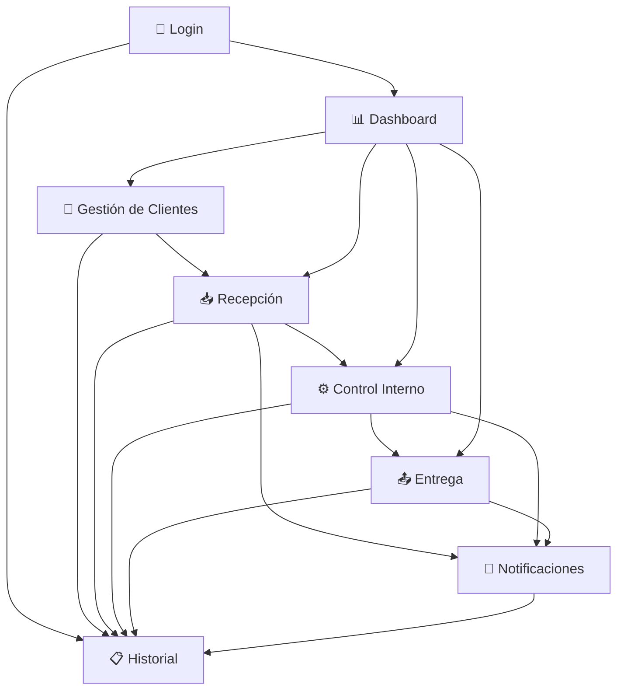

# 🧺 Sistema de Gestión de Lavandería RFID

## Documentación de Funcionalidades por Pantalla

---

## 📋 **Índice de Pantallas**

1. [🔐 Pantalla de Login](#-1-pantalla-de-login)
2. [📊 Dashboard](#-2-dashboard)
3. [👥 Gestión de Clientes](#-3-gestión-de-clientes)
4. [📥 Recepción](#-4-recepción)
5. [⚙️ Control Interno](#️-5-control-interno)
6. [📤 Entrega](#-6-entrega)
7. [📧 Notificaciones](#-7-notificaciones)
8. [📋 Historial](#-8-historial)

---

## 🔐 **1. Pantalla de Login**

**Archivo:** `auth.js`

### **Función Principal**

Autenticación segura de usuarios en el sistema

### **Funcionalidades**

- ✅ **Login con credenciales**

  - Usuario y contraseña
  - Selección de sucursal
  - Credenciales demo: `admin/admin123`
- 🔒 **Seguridad**

  - Gestión de sesiones (8 horas de duración)
  - Protección contra intentos fallidos (máximo 5 intentos)
  - Bloqueo temporal tras intentos fallidos
  - Validación de sesiones activas
- 📱 **Características**

  - Interfaz responsive
  - Auto-logout por inactividad
  - Información de dispositivo en logs
  - Restauración de sesión al recargar

---

## 📊 **2. Dashboard**

**Archivo:** `dashboard.js`

### **Función Principal**

Panel de control central con resumen ejecutivo del sistema

### **Funcionalidades**

#### **📈 Estadísticas en Tiempo Real**

- Clientes registrados
- Prendas en proceso
- Prendas listas para entrega
- Lotes activos
- Actualización automática cada 30 segundos

#### **📋 Estado de Prendas**

- Distribución visual por estados:
  - 📥 **Recibidas** - Prendas ingresadas al sistema
  - ⚙️ **En Proceso** - Prendas siendo procesadas
  - ✅ **Listas** - Prendas terminadas
  - 📤 **Entregadas** - Prendas ya entregadas
- Barras de progreso proporcionales

#### **🔄 Actividad Reciente**

- Últimas 5 operaciones del sistema
- Timestamps relativos ("Hace X minutos")
- Iconos identificativos por tipo de operación
- Enlaces directos al historial completo

#### **⚡ Acciones Rápidas**

- 📥 **Recibir Prendas** → Acceso directo a Recepción
- 📤 **Entregar Prendas** → Acceso directo a Entrega
- 👥 **Gestionar Clientes** → Acceso directo a Clientes
- 🔍 **Escanear RFID** → Modal de búsqueda rápida

#### **🏆 Top 5 Clientes**

- Clientes más activos por número de servicios
- Acceso rápido al perfil de cada cliente
- Estadísticas de servicios

## 👥 **3. Gestión de Clientes**

**Archivo:** `clients.js`

### **Funcionalidades**

#### **📋 Lista de Clientes**

- Vista tabular con información completa
- Ordenamiento por: nombre, cédula, servicios, fecha registro
- Contadores de prendas activas por cliente
- Estados dinámicos: Activo, Registrado, Nuevo

#### **👤 Perfil Detallado del Cliente**

- **Información Personal:**

  - Datos de contacto completos
  - Dirección
  - Etiquetas RFID asociadas
  - Fecha de registro
- **📊 Estadísticas de Servicio:**

  - Total de prendas procesadas
  - Prendas actualmente en proceso
  - Servicios del mes actual
  - Tiempo promedio de procesamiento
- **👕 Prendas Actuales:**

  - Lista de prendas en el sistema
  - Estados de cada prenda
  - Códigos RFID
  - Enlaces al control interno

#### **✏️ Gestión CRUD**

- **Crear Cliente:**

  - Formulario completo con validaciones
  - Campos obligatorios: nombre, cédula
  - Validación de cédula única
- **Editar Cliente:**

  - Actualización de datos
  - Preservación del historial
  - Registro de cambios
- **Eliminar Cliente:**

  - Validación de prendas activas
  - Confirmación de seguridad
  - Registro en historial

#### **📊 Importar/Exportar**

- **Exportar a CSV:**

  - Datos completos de clientes
  - Estadísticas incluidas
  - Formato compatible con Excel
- **Importar desde CSV:**

  - Validación de datos
  - Detección de duplicados
  - Reporte de errores

#### **🎯 Acciones Directas**

- 📥 **Nuevo Servicio** → Salto directo a Recepción
- 👁️ **Ver Perfil** → Vista detallada
- ✏️ **Editar** → Formulario de edición
- 🗑️ **Eliminar** → Con validaciones de seguridad

---

## 📥 **4. Recepción**

**Archivo:** `reception.js`

### **Función Principal**

Ingreso de nuevas prendas al sistema con tecnología RFID simulada

### **Funcionalidades**

#### **📋 Proceso en 3 Pasos**

1. **👤 Selección de Cliente**
2. **👕 Escaneo de Prendas**
3. **✅ Confirmación y Lote**

#### **🔍 Simulador de Escáner RFID**

- Entrada manual de códigos RFID
- Validación de códigos únicos
- Generación automática de códigos si es necesario
- Interfaz que simula escáner real

#### **📦 Gestión por Lotes**

- Agrupación automática de prendas por cliente
- Numeración secuencial de lotes (L001, L002, etc.)
- Asignación de sucursal
- Cálculo automático de totales

#### **👕 Información Detallada por Prenda**

- **Identificación:**

  - Código RFID único
  - Numeración automática si no se especifica
- **Características:**

  - Tipo de prenda (camisa, pantalón, vestido, chaqueta, etc.)
  - Color
  - Talla (XS, S, M, L, XL, XXL)
- **Estado y Condición:**

  - Condición: bueno, regular, delicado, manchado, roto
  - Prioridad: normal, alta, urgente
  - Notas especiales del cliente

#### **✅ Validaciones del Sistema**

- Códigos RFID únicos en el sistema
- Campos obligatorios completados
- Cliente seleccionado válido
- Mínimo una prenda por lote

#### **🔄 Generación Automática**

- **Lotes:** Numeración automática y secuencial
- **Códigos RFID:** Si no se especifica, genera automáticamente
- **Timestamps:** Fecha y hora de recepción
- **Estados:** Asignación automática de estado inicial

#### **📧 Notificaciones Automáticas**

- Email interno sobre nuevos lotes recibidos
- Configuración de destinatarios
- Plantillas personalizables
- Variables dinámicas (cliente, cantidad, sucursal)

#### **🔗 Integración**

- Acceso directo desde perfil de cliente
- Preservación de contexto entre pantallas
- Navegación fluida en el proceso

---

## ⚙️ **5. Control Interno**

**Archivo:** `control.js`

### **Función Principal**

Seguimiento completo y actualización de estados de prendas y lotes

### **Funcionalidades**

#### **📦 Gestión de Lotes**

- **Vista por Lotes:** Agrupación de prendas en lotes
- **Vista por Clientes:** Lotes agrupados por cliente
- **Progreso de Lotes:** Porcentaje de completitud
- **Estados de Lotes:** Sincronización con prendas individuales

#### **🔄 Gestión de Estados**

- **Estados Disponibles:**

  - 📥 **Recibido** - Prenda ingresada
  - ⚙️ **En Proceso** - Siendo procesada
  - ✅ **Listo** - Terminada, lista para entrega
  - 📤 **Entregado** - Entregada al cliente

#### **🔍 Filtros y Búsqueda Avanzada**

- **Filtros por:**

  - Estado de prendas
  - Sucursal
  - Cliente específico
  - Rango de fechas
- **Búsqueda por:**

  - Código RFID
  - Nombre de cliente
  - Tipo de prenda
  - Color

#### **📝 Gestión Detallada**

- **Por Prenda:**

  - Historial completo de cambios
  - Notas con timestamps
  - Información del cliente
  - Detalles técnicos
- **Por Lote:**

  - Estado general del lote
  - Progreso de completitud
  - Prendas incluidas
  - Histórico de cambios

#### **📊 Exportación y Reportes**

- Exportación de listas filtradas
- Formato CSV para análisis
- Datos completos incluidos
- Compatible con Excel

---

## 📤 **6. Entrega**

**Archivo:** `delivery.js`

### **Función Principal**

Procesamiento eficiente de entregas y gestión de lotes listos

### **Funcionalidades**

#### **📂 Organización por Pestañas**

##### **✅ Listos para Entrega**

- Vista de todos los lotes en estado "Listo"
- Información del cliente y contacto
- Número de prendas por lote
- Prioridad del lote
- Fecha de finalización

##### **📋 Entregados**

- Historial completo de entregas realizadas
- Filtro por cliente específico
- Fechas de entrega
- Registro de operador que entregó

#### **🔄 Gestión de Lotes Listos**

- **Información Mostrada:**

  - Número de lote
  - Cliente responsable
  - Cantidad de prendas (actuales/esperadas)
  - Nivel de prioridad
  - Fecha de creación

#### **📊 Historial de Entregas**

- **Filtros Disponibles:**

  - Todos los clientes
  - Cliente específico
  - Rango de fechas
- **Información Registrada:**

  - Lote entregado
  - Cliente receptor
  - Cantidad de prendas
  - Fecha y hora exacta de entrega
  - Operador responsable

#### **🔄 Actualización Automática**

- Cambio de estado de lotes a "Entregado"
- Propagación a prendas individuales
- Registro en historial del sistema
- Actualización de estadísticas

#### **⚡ Interfaz Simplificada**

- Diseño enfocado en rapidez operativa
- Acciones con un solo clic
- Información esencial visible
- Navegación intuitiva

#### **🔗 Integración con Sistema**

- Sincronización con Control Interno
- Actualización del Dashboard
- Registro en Historial general
- Notificaciones automáticas (opcional)

---

## 📧 **7. Notificaciones**

**Archivo:** `notifications.js`

### **Función Principal**

Sistema completo de comunicación con clientes (simulado pero realista)

### **Funcionalidades**

#### **⚙️ Configuración de Mensajes Automáticos**

##### **🏭 Notificaciones Internas**

- **Nuevo Lote Registrado:**
  - Destinatario: Email corporativo configurable
  - Variables: {batch_number}, {client_name}, {garment_count}
  - Envío automático al crear lotes

##### **👤 Notificaciones a Clientes**

- **Lote Listo para Entrega:**
  - Detección automática de lotes listos
  - Envío al cliente correspondiente
  - Variables: {client_name}, {batch_number}, {branch_name}

#### **📤 Envío Manual de Notificaciones**

- **Selección de Cliente:** Lista de clientes de la sucursal
- **Editor de Contenido:** Asunto y mensaje personalizables
- **Vista Previa:** Revisión antes del envío
- **Procesamiento de Variables:** Sustitución automática

#### **📋 Historial Completo**

- **Registro de Envíos:**

  - Tipo de notificación
  - Cliente destinatario
  - Contenido del mensaje
  - Fecha y hora de envío
  - Estado (enviada, pendiente, fallida)
  - Operador responsable
- **Funcionalidades del Historial:**

  - Filtro por cliente
  - Búsqueda por contenido
  - Reenvío de notificaciones
  - Detalles completos de cada envío

#### **🎭 Simulación Realista**

- **Animación de Envío:**

  - Barra de progreso
  - Mensajes de estado
  - Confirmación de entrega
- **Estados Simulados:**

  - Conectando con servidor
  - Validando datos
  - Enviando notificación
  - Confirmando entrega

#### **🔧 Configuración Avanzada**

- Personalización de plantillas automáticas
- Configuración de destinatarios internos
- Variables personalizables por sucursal
- Gestión de templates corporativos

---

## 📋 **8. Historial**

**Archivo:** `history.js`

### **Función Principal**

Registro completo y consulta avanzada de todas las operaciones del sistema

### **Funcionalidades**

#### **🔍 Filtros Avanzados**

##### **📂 Por Tipo de Actividad**

- **📥 Recepciones** - Ingreso de nuevas prendas
- **📤 Entregas** - Prendas entregadas a clientes
- **⚙️ Cambios de Estado** - Actualizaciones de proceso
- **👥 Gestión de Clientes** - Creación/edición de clientes
- **📧 Notificaciones** - Mensajes enviados
- **🔧 Sistema** - Operaciones técnicas

##### **📅 Por Período de Tiempo**

- **Hoy** - Actividades del día actual
- **Esta Semana** - Últimos 7 días
- **Este Mes** - Mes actual
- **Todo el Tiempo** - Sin restricción temporal
- **Personalizado** - Rango de fechas específico

##### **👤 Por Cliente Específico**

- Filtro directo desde perfil de cliente
- Historial completo de un cliente
- Todas las interacciones registradas

#### **🔍 Búsqueda de Texto Libre**

- Búsqueda en tiempo real
- Busca en: detalles, operadores, códigos RFID
- Resultados instantáneos
- Destacado de términos encontrados

#### **📊 Vista Detallada de Actividades**

##### **⏰ Información Temporal**

- Timestamp preciso (fecha y hora)
- Tiempo relativo ("Hace 2 horas")
- Agrupación por fechas
- Orden cronológico (más reciente primero)

##### **👤 Información del Operador**

- Usuario que realizó la operación
- Rol del usuario
- Información de sesión

##### **📝 Detalles Específicos**

- Descripción completa de la operación
- Códigos RFID involucrados
- Estados anteriores y nuevos
- Notas adicionales del operador

##### **🔗 Referencias Cruzadas**

- Enlaces a clientes involucrados
- Referencias a prendas específicas
- Conexión con lotes
- Navegación contextual

#### **📈 Estadísticas y Contadores**

- **Por Período:**

  - Número de operaciones por día/semana/mes
  - Distribución por tipo de actividad
  - Operadores más activos
- **Por Sucursal:**

  - Actividad por ubicación
  - Comparativas entre sucursales
  - Métricas de rendimiento

#### **🗂️ Agrupación Inteligente**

- **Por Fechas:** Actividades del mismo día
- **Por Tipos:** Operaciones similares agrupadas
- **Por Clientes:** Todas las actividades de un cliente
- **Por Lotes:** Historial completo de un lote

#### **📊 Exportación y Reportes**

- **Exportar a CSV:**

  - Datos filtrados aplicados
  - Información completa de cada entrada
  - Compatible con Excel y análisis
- **Reportes Específicos:**

  - Actividad por operador
  - Resumen por período
  - Métricas de rendimiento

#### **🎯 Navegación Contextual**

- **Desde Dashboard:** Actividad reciente expandida
- **Desde Clientes:** Historial específico del cliente
- **Desde Control:** Cambios de estado de prendas
- **Enlaces Bidireccionales:** Navegación de regreso al contexto

#### **📱 Interfaz Responsiva**

- Adaptada para móviles y tablets
- Filtros colapsables en pantallas pequeñas
- Información esencial siempre visible
- Navegación optimizada para touch

---

## 🔄 **Flujo Operativo Principal**

### **📋 Descripción del Flujo**

1. **🔐 Login** → Autenticación segura en el sistema
2. **📊 Dashboard** → Visión general y acceso rápido a funciones
3. **👥 Clientes** → Gestión de base de datos de clientes
4. **📥 Recepción** → Ingreso de nuevas prendas (genera lotes)
5. **⚙️ Control Interno** → Seguimiento y cambios de estado
6. **📤 Entrega** → Procesamiento de entregas completadas
7. **📧 Notificaciones** → Comunicación automática con clientes
8. **📋 Historial** → Consulta de todas las operaciones realizadas

---

## 🎯 **Características Técnicas Destacadas**

### **🔧 Arquitectura**

- **Modular:** Cada pantalla es independiente pero integrada
- **Responsive:** Adaptado para dispositivos móviles
- **Simulación RFID:** Tecnología simulada realísticamente
- **Almacenamiento Local:** Persistencia de datos en navegador

### **🔒 Seguridad**

- Validación de sesiones
- Protección contra intentos de login
- Validación de datos de entrada
- Logs de auditoría completos

### **🎨 Experiencia de Usuario**

- Navegación intuitiva entre módulos
- Preservación de contexto
- Feedback visual inmediato
- Animaciones y transiciones suaves

### **📊 Datos e Integración**

- Validaciones cruzadas entre módulos
- Integridad referencial de datos
- Sincronización en tiempo real
- Exportación/importación de datos

---

## 🚀 **Tecnologías Utilizadas**

- **Frontend:** HTML5, CSS3, JavaScript ES6+
- **Framework CSS:** Bootstrap 5.3.0
- **Iconos:** Font Awesome 6.5.2
- **Fuentes:** Google Fonts (Inter)
- **Almacenamiento:** LocalStorage API
- **Simulación:** Códigos RFID generados automáticamente

---

## 📞 **Soporte y Documentación**

Para más información sobre el uso del sistema:

- Consulte la documentación de cada módulo
- Revise los comentarios en el código fuente
- Utilice las credenciales demo para pruebas
- El sistema incluye datos de ejemplo para testing

---

*Documentación generada para el Sistema de Gestión de Lavandería RFID*
*Versión: 1.0 | Fecha: 2024*

